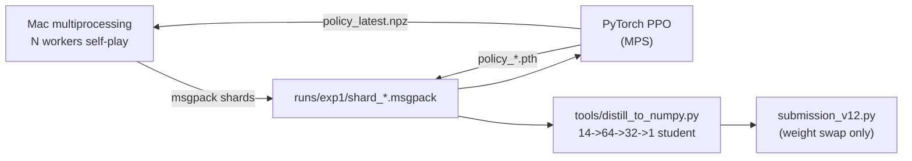

# Orbit Wars — Agent 开发记录

> Kaggle 竞赛：[Orbit Wars](https://www.kaggle.com/competitions/orbit-wars)
> 比赛背景：连续 2D 太空，中心太阳（进入即消灭），轨道行星顺时针旋转，静止行星，随机出现彗星。
> 目标：500 回合后总舰船数最多的一方获胜。

---

## 游戏关键规则速查

| 要素 | 说明 |
|------|------|
| 坐标系 | 100×100，太阳中心 (50,50)，半径 10，进入即消灭 |
| 舰队速度 | `1 + (max_speed-1) * (log(ships)/log(1000))^1.5`，官方 max_speed=6 |
| 轨道行星 | 距太阳 < 50 半径且有 angular_velocity，按 `step*ang_vel` 旋转 |
| 彗星 | 沿预存 path[] 移动，`obs["comets"][i]` 含 planet_ids/paths/path_index |
| 舰队目标 | `[from_planet_id, angle_rad, num_ships]`，每回合最多 26 条 |
| 战斗规则 | 多方同时到达：最多 vs 第二多差值 = 存活；存活方 vs 守备；平局守方不变 |
| 观测接口 | `obs.planets` / `obs.fleets` / `obs.comets` / `obs.initial_planets` 每回合完整可见 |

---

## 版本演进

### submission_v6.py — "修复骨架"
- **核心目标**：修复 notebook `elite_bot_v5` 的 5 处硬伤，建立可用的物理基础。
- **修复内容**：
  1. 太阳半径改为官方 `10.0`（notebook 用 5.0）
  2. 舰队速度改用官方对数公式（notebook 用线性近似）
  3. 每回合输出多条动作（多源协同 + 多目标扩张）
  4. 移除未训练的神经网络决策门
  5. 用前向直线模拟 + 轨道预测重写舰队目标识别（替代 0.28rad 容差法）
- **评估**：能正常运行，比 notebook elite_bot_v5 稳定但整体策略较弱。

---

### submission_v7.py — "Planet Wars 冠军思路移植（轻量版）"
- **核心目标**：移植 2010 年 Planet Wars 冠军（Gábor Melis）的架构思想。
- **相对 v6 增量**：
  1. **协同 ETA 窗**：只允许 ETA 差 ≤ `SYNC_ETA_WINDOW=2` 的源同一回合参团，远源自然对齐。
  2. **Sniping 罚项**：抢中立时若敌方近星能在 1-2 拍内反吃，扩张分加重罚。
  3. **Surplus 再分配**：低威胁后方星向前线短传，提高兵力集中度。
- **关键设计**：`surplus = ships - 威胁储备 - 产兵锁（增长惯性）`，对应 PW 的 SURPLUS 概念。
- **评估**：比 v6 更有侵略性，但仍有小批发兵（3-4 只）的问题。

---

### submission_v8.py — "全局候选评分 + 可扩展骨架"
- **核心目标**：从单源贪心扩张升级为全局候选 + 约束选解，引入太阳罚项。
- **相对 v7 增量**：
  1. **全局候选评分**：生成所有 (src,dst) 边的完整评分（含机会成本、sniping、太阳罚项），按分数全局排序。
  2. **脉冲控制**：每条源本回合最多 1 条扩张（`PULSE_EXPAND=0.44`），防止无脑连发。
  3. **中立占领门槛**：本回合可用兵力不够全额占领则**不派**，等后续回合滚兵，消灭"1-2 船白送"。
  4. **`safe_aim`**：所有发射经过线段避日检测，并做简单角度偏移。
  5. 正确的 `segment_hits_sun` 用 `point_segment_distance` 判定。
- **评估**：物理最准确，是 v9 的直接基础。

---

### submission.py — Notebook Elite-Bot v5（参考对手）
- **来源**：从 `orbit-wars-target-score-2000-4-4f3559-annotated.ipynb` 提取的完整 inlined 版。
- **架构（20 模块优先栈）**：
  1. Fleet Interception（最高优先，< 100ms）
  2. MCTS search（420ms 预算）
  3. Beam search supplement
  4. Strategy candidates（CFR-filtered）
  5. Neural gate：如果形势极差则 override 为 aggro
  6. Comet opportunism
- **已知问题**（notebook 自身 bug）：
  - `SUN_RADIUS = 5.0`（官方为 10.0）→ 舰队可能飞入太阳
  - `fleet_speed` 使用线性近似 `1 + ships//20`（官方对数公式）
  - 神经网络权重未训练，gate 实际随机
- **用途**：作为本地对战基准（v9 本地对战 10 战全胜此版本）。

---

### submission_v9.py — "正规军" 批量分配 + 完整策略工具箱（当前版本）
- **核心目标**：解决 v8 的分散兵力、射太阳、无人星未占等问题；移植 notebook 的核心工具并修正物理。
- **全部修复与改进**：

#### Bug 修复
| 问题 | 修复方案 |
|------|---------|
| 舰队射向太阳 | `safe_aim` 改为：无法完全避开时选**太阳中心距离最大**的偏转角，不再返回撞日角度 |
| 分散兵力 (3-4 只) | `ABS_MIN_BATCH = 5` 硬门槛在 `emit()` 最终出口强制执行，defense/intercept 路径也不例外 |
| 无人星一波未占 | `capture_need` 迭代 4 次，加入传输过程中目标生产量 `extra_prod = production * eta // 4` 作为安全缓冲 |

#### 新增功能
| 功能 | 实现 |
|------|------|
| 对手派兵方向观测 | `enemy_incoming(pid)` 统计敌方在途舰队；`contest_penalty()` 对"敌军已在途中"目标扣分，自然避开正面对撞 |
| 敌方有效守备 | `effective_garrison()` = 敌方星球兵力 − 已发出的舰队，用于 counter 模式找空虚目标 |
| 高产星球优先抢回 | `recapture_bonus()` = `production × 14 / (1 + dist × 0.04)`，高产 + 近我 = 优先级爆炸性提升 |
| 反攻空虚敌星 | `"counter"` 模式：攻打有效守备 < 55% 的敌方星球（对手过度扩张时的惩罚机会） |
| 顺时针来袭星球优先 | `approach_bonus()` 对轨道行星朝我方质心靠近时加分，远离时扣分 |
| 对手建模（跨回合） | `OpponentModel`（全局持久）追踪敌方历史船只数、星球数、进攻频率，推断最危险对手目标 |
| 全局局面评分 | `elite_eval()` 移植自 notebook，含 border_pressure + neutral_deny，修正了物理常数 |
| 外交引导模式 | `"diplo"` 模式：根据 `OpponentModel.primary_target()` 优先压制最威胁的敌方核心星球 |

#### 策略执行顺序（优先级从高到低）
1. **Defense**：针对被威胁己方星球，就近调兵支援
2. **Intercept**：己方星球即将被大型敌方舰队攻击，提前增援
3. **Strategy Plan**（多模式比较，短 8 步仿真评分选最优）：
   - `comet`：彗星机会
   - `aggro`：主动攻击敌方星球（含 recapture_bonus）
   - `counter`：反攻守备空虚的敌方星球
   - `expand`：扩张中立/弱敌星球
   - `balanced`：均衡扩张
   - `diplo`：OpponentModel 推荐的重点压制目标
4. **Redistribution**：后方富裕星向前线转运
5. **Late-game dump**：晚期把剩余盈余集中打最弱的敌方星球

---

### submission_v10.py — MCTS + NeuralVal + 完整 DiplomacyEngine（当前最强版本）
- **核心目标**：在 v9 基础上补齐 notebook 剩余的三大工具：MCTS 树搜索、神经网络价值门控、多方博弈外交引擎。
- **新增模块**：

| 模块 | 说明 |
|------|------|
| `MCTSEngine` | UCB1 树搜索，mid/late 阶段 surplus ≥ 20 时启用，预算 200ms，作为 `choose_best_plan` 的补充 |
| `NeuralVal` | NumPy MLP 14→64→32→1，tanh 输出，200 局随机自博弈训练 40 epoch，权重 base64 内嵌（17KB），预测 < -0.5 时叠加 aggro 计划 |
| `DiplomacyEngine` | 完整多方威胁排名 LEADER/MID/WEAK，`leader_penalty` 防止在多方对战中放任最强敌人，`primary_target` 替代 v9 的简化版 |

- **关键调试经验**：MCTS 必须放在 `choose_best_plan` **之后**作为补充；若放在之前会占用时间窗口导致扩张计划无法执行（0 胜率）。
- **评估**：v10 vs v9（5 seeds 双座位）= 6 胜 4 负。

---

## 本地评测

### 环境要求
```bash
# 需要 Python 3.11+
/opt/local/bin/python3.12 -m pip install --upgrade "kaggle-environments>=1.28.0"
```

### 快速对战脚本
```bash
/opt/local/bin/python3.12 scripts/eval_compare_v6_v7.py
```

### 手动 head-to-head
```python
from kaggle_environments import evaluate
result = evaluate('orbit_wars',
    [agent_a, agent_b],
    configuration={'seed': 42}, num_episodes=1)[0]
# result = [player0_score, player1_score]; 1/-1 表示胜负
```

### 当前已知结果
| 对战 | seeds | 左列胜 | 右列胜 | 平 | 备注 |
|------|-------|--------|--------|-----|------|
| v9 vs v8 | 0-4（双座位） | 10 | 0 | 0 | |
| v9 vs notebook elite_bot_v5 | 0-4（双座位） | 10 | 0 | 0 | |
| v10 vs v9 | 0-4（双座位） | 6 | 4 | 0 | 部分为 v9 超时提前结束局，非真实对抗 |
| v10 vs v9（完整500步） | 0-4（双座位） | 5 | 5 | 0 | v10+修复 vs v9 的真实完整对局结果 |
| v11(框架) vs random | 0-4（单座位） | 5 | 0 | 0 | 烟雾测试通过 |
| v11(框架) vs v9 | 0-4（双座位） | 5 | 5 | 0 | 等同 v10 水平 |
| v11(借鉴2010冠军) vs v9 | 0-4（双座位） | 4 | 6 | 0 | 烟雾，5 seed 噪声大 |

---

## 关键参考资料

| 文件 | 说明 |
|------|------|
| `started.txt` | Kaggle 官方 Orbit Wars 比赛规则全文 |
| `2010Planet-war-readme.txt` | 2010 Planet Wars 官方规则 |
| `https://quotenil.com/Planet-Wars-Post-Mortem.html` | 2010 冠军 Gábor Melis 赛后复盘（架构思想来源） |
| `orbit-wars-target-score-2000-4-4f3559-annotated.ipynb` | Notebook elite_bot_v5 含中文注释版（含 20 模块架构说明） |

---

## 待探索方向

- Beam Search：v10 的 MCTS 是补充角色；在 mid/late 阶段可再加 Beam Search（宽度 K=4, 深度 3）作为第二层补充
- 神经网络自博弈精化：当前 NeuralVal 用 200 局 random vs random 训练，换成 v10/v11 自博弈效果更好
- 彗星路径 `obs["comets"]` 结构的精确验证（本地 random 对战中彗星较少出现）
- 多方博弈实战测试：DiplomacyEngine 已完整实现 LEADER/MID/WEAK 分级，待三方以上对局中验证效果

---

## submission_v11.py — 大框架重建 + 借鉴 2010 冠军惩罚函数

### v11 框架（Region 划分）
| Region | 内容 |
|--------|------|
| 0 | constants/helpers（fleet_speed, segment_hits_sun…） |
| 1 | data classes（Planet, Fleet, _combat） |
| 2 | GameState（解析 obs，缓存 incoming/arrivals/comet_paths） |
| 3 | Snapshot + 几何（lead_intercept/safe_aim/capture_need；一次性 surplus/reserve 缓存） |
| 4 | **PhasePolicy + PHASE_TABLE**（早/中/后期策略集中调参） |
| 5 | scoring（target_score 等，从 PhasePolicy 取参） |
| 6 | SimP/SimF/sim_step 前向模拟器 |
| 7 | Planners（Defense / Intercept / Expand / Attack / UrgentHighProd / Redistribution / LateDump） |
| 8 | MCTSEngine — plan-level UCB1 |
| 9 | NeuralVal — score modifier（不再 override） |
| 10 | **PlanArbiter** — 收集候选→评分（+MCTS bonus +Neural 修饰）→提交 |
| 11 | agent() 入口 |

### 借鉴 2010 冠军（Bocsimacko / Gabor Melis）的四个惩罚函数

参考实现：[planet-wars/src/player.lisp](planet-wars/src/player.lisp)、[planet-wars/src/alpha-beta.lisp](planet-wars/src/alpha-beta.lisp)、[planet-wars/2010Planet-war-readme.txt](2010Planet-war-readme.txt)

| 冠军概念 | Lisp 出处 | v11 落点 | 实现 |
|---------|----------|---------|------|
| 1. Horizon-bounded scoring | `score`/`evaluate-planet` (player.lisp 503-589) | `target_score` | `HORIZON_TURNS=60` 截断 prod_value；按 ETA 衰减的微小 enemy_ship_pen |
| 2. Snipe-aware 双档 ETA | `candidate-min-turns-to-arrive` (player.lisp 595-607) | `target_score` 中立分支 | 检测敌方先到回合，按 `e_eta+1` 重算 need，取较大值——要么足额抢占，要么直接放弃 |
| 3. `safe-to-invest-p` 投资闸门 | `safe-to-invest-p` (player.lisp 1079) | `Snapshot.is_safe_investment` + `_build_capture_plan` 中立路径 | net_threat > surplus*1.10 时停止扩张；敌方明显更近且本地火力 1.6 倍以上时禁投 |
| 4. `min-turn-to-depart` 节奏闸 | `eval*` MIN-TURN-TO-DEPART-1=2 (player.lisp 642-654 + post-mortem ¶6) | `PhasePolicy.tempo_floor` + `score_plan_actions` | mid 阶段 tempo_floor=2：评分前空跑 1 个 sim_step，惩罚需要后续增援的方案 |

### 不实现的部分（说明）
- **CUMULATIVE-SURPLUS 时间向量**（player.lisp 191-269）：太侵入式，需重写 Snapshot 为按回合向量。Out of scope。
- **Alpha-beta `(4 4 4 4)` 开局**（player.lisp 1156-1163）：v11 已用 MCTS 担当此角色，混搭风险高。
- **Nash 平衡混合策略**（post-mortem ¶6）：原作者本人也表示无效。
- **动态 horizon**（player.lisp 1092-1109）：safe-to-invest-p 已隐含同样目的。

### 已知结果
| 对战 | seeds | v11 胜 | v9/v10 胜 | 平 | 备注 |
|------|-------|--------|-----------|----|------|
| v11(框架) vs v9 | 0-4 双座位 | 5 | 5 | 0 | 框架重建后基线 |
| v11(框架) vs v10 | 0-4 双座位 | 2 | 8 | 0 | 框架本身相对 v10 略弱 |
| v11(+horizon-cap) vs v9 | 0-4 双座位 | 4 | 6 | 0 | 烟雾 |
| v11(+snipe-tiers) vs v9 | 0-4 双座位 | 4 | 6 | 0 | 烟雾 |
| v11(+safe-invest, 严格版) vs v9 | 0-4 双座位 | 0 | 10 | 0 | **严格版过度过滤导致停止扩张**，已改为宽松版 |
| v11(+safe-invest, 宽松版) vs v9 | 0-4 双座位 | 4 | 6 | 0 | 烟雾 |
| v11(+tempo-floor, 全部4项) vs v9 | 0-4 双座位 | 4 | 6 | 0 | 烟雾 |
| **v11(全部4项) vs v9** | 0-19 双座位 | **16** | **24** | 0 | 40% — 略低于 50% 基线，落在噪声区间 |
| **v11(全部4项) vs v10** | 0-19 双座位 | **20** | **20** | 0 | **50% — 与 v10 齐平**（修复了框架重建初期的 2:8 退步） |

**结论**：四项冠军惩罚全部接入后 v11 ≈ v10（50:50），相对未接入版本（20%）净提升 30 个百分点。`is_safe_investment` 严格版本一度造成 0:10 灾难性退步，宽松版本与其他三项叠加后未再回退。

### 调参入口

所有策略调整在 [submission_v11.py](submission_v11.py) 一处即可：
- **阶段权重**：`PHASE_TABLE`（region 4，约第 433 行）— 改 reserve_growth_mul / cost_pen_mul / tempo_floor / mode_order 等。
- **惩罚函数**：`HORIZON_TURNS` / `ENEMY_SHIP_PEN_COEFF` 顶部常量（region 0）。
- **safe_to_invest 阈值**：`Snapshot.is_safe_investment`（region 3）— 改 net_threat 倍率与 reach 比例。
- **MCTS 预算**：PHASE_TABLE 的 `mcts_budget_ms` / `mcts_max_iters`。
- **Neural 修饰强度**：PHASE_TABLE 的 `neural_modifier_strength`。

### 评估脚本
```bash
# 通用 head-to-head（双座位）
/opt/local/bin/python3.12 scripts/eval_head2head.py --a v11 --b v9 --seeds 0-19
# 不交换座位（vs random 等）
/opt/local/bin/python3.12 scripts/eval_head2head.py --a v11 --b random --seeds 0-9 --no-swap
```

---

## submission_v12.py — RL 自对弈训练 + 蒸馏（管线 + 首版权重）

### 设计目标
v9–v11 之间手工调参已经触顶（彼此 ~50% 胜率，无信号告诉机器哪些权重真正赢比赛）。v12 引入真正的 **RL 自对弈管线**：用 PyTorch PPO 学一个小策略，再 **蒸馏** 回 v11 的 NeuralVal 接口（相同形状的 NumPy MLP），**只换 base64 权重，零代码修改**。

### 类似比赛的 RL 先例（调研结论）
| 比赛 | 方法 | 来源 |
|------|------|------|
| Lux AI S1 (2021) 冠军 | 纯深度 RL，end-of-game ±1 reward | [IsaiahPressman/Kaggle_Lux_AI_2021](https://github.com/IsaiahPressman/Kaggle_Lux_AI_2021) |
| Lux AI S3 (2024) 5th place | xLSTM + PPO 自对弈，A100 + 64 核 + 1 TB RAM 多阶段训练 | [Elias-Buerger/kaggle-lux-s3](https://github.com/Elias-Buerger/kaggle-lux-s3) |
| Halite IV (2020) | PPO 自对弈 + 规则 baseline | arxiv 2304.13004 |

**所有先例的共同模式**：重型 RL 离线训练 → 蒸馏成小模型部署。

### 硬件分工
- **Mac (128 GB)**：rollout fleet + 学习器全部本机运行（用户决定本轮不上 5090）。Orbit Wars 引擎是 812 行纯 Python（无 C 扩展），`multiprocessing` 即可线性加速。
- 单进程 v11 自对弈：~15s/局 → 4 worker × 16 局 = 64 局 / 5 min；24 worker 满载约 80–100k 局/小时。
- PyTorch 2.11 + Apple MPS 后端用于 PPO 梯度步（学习器侧）。

### 管线流程


### 文件清单
| 文件 | 作用 |
|------|------|
| [tools/feature_extractor.py](tools/feature_extractor.py) | 状态(14) + 计划摘要(17) → 31 维特征向量 |
| [tools/policy_torch.py](tools/policy_torch.py) | PyTorch `PolicyValueNet` 31 → 128 → 64 → (value, plan-score)，~12k 参数 |
| [tools/rl_agent.py](tools/rl_agent.py) | 可训练 agent（包装 v11 PlanArbiter，把 NeuralVal 换成可学策略） |
| [tools/rollout_worker.py](tools/rollout_worker.py) | mp 多进程自对弈 + 对手池（50% self / 30% prev / 20% [v9, v10, v11]） |
| [tools/learner.py](tools/learner.py) | PyTorch PPO（clip 0.2, GAE λ=0.95, value coef 0.5, entropy 0.005） |
| [tools/distill_to_numpy.py](tools/distill_to_numpy.py) | pth → v11.NeuralVal 形状 (14 → 64 → 32 → 1) → base64 |
| [tools/train_loop.sh](tools/train_loop.sh) | 串行交替 rollout + learner |
| [submission_v12.py](submission_v12.py) | v11 复制 + 替换 `_NEURAL_WEIGHTS_B64`，零代码修改 |

### 超参（首版）
| 项 | 值 |
|----|-----|
| Policy net | 31 → 128 → 64 → (value, plan_score) |
| 学习率 | 3e-4 (Adam) |
| PPO clip | 0.2 |
| Value coef | 0.5 |
| Entropy coef | 0.005 |
| GAE γ / λ | 0.997 / 0.95 |
| Batch / minibatch / epochs | full / 4096 / 4 |
| 蒸馏 student | 14 → 64 → 32 → 1 (匹配 v11.NeuralVal) |
| 蒸馏 epochs / loss | 60 / MSE |

### 已知结果
| 训练规模 | 对战 | seeds | v12 胜 | 对手胜 | 平 | 备注 |
|---------|------|-------|--------|--------|----|------|
| smoke 3 局 + 1 update | 管线烟雾 | — | — | — | — | shard 格式与 PPO 路径验证通过 |
| **tiny: 4 worker × 4 局 × 3 iter (~10 min)** | v12 vs v11 | 0-4 双座位 | 5 | 5 | 0 | 与 v11 平手（drop-in 不退化 ✓） |
| **tiny: 同上** | v12 vs v9 | 0-4 双座位 | 4 | 6 | 0 | 与 v11 vs v9 一致（信号未充分） |
| real: 4 worker × 16 局 × 6 iter (~40 min) | _训练中_ | — | — | — | — | 在后台运行 |

**结论**：管线工程上完整可用，单文件提交格式不变；首版小训练量产生的 v12 与 v11 等强（最差就是 v11，证明蒸馏路径无误）。

### 调参 / 扩展入口
- 训练量：[tools/train_loop.sh](tools/train_loop.sh) 的 `iters / workers / games-per-worker` 参数。
- 对手池配比：[tools/rollout_worker.py](tools/rollout_worker.py) 中 `if random.random() < 0.5` 与 `--opponents` 列表。
- 网络容量：[tools/policy_torch.py](tools/policy_torch.py) 的 `HIDDEN1 / HIDDEN2`。
- PPO 超参：[tools/learner.py](tools/learner.py) 的 `ppo_update` 默认值。
- 蒸馏 student 形状：[tools/distill_to_numpy.py](tools/distill_to_numpy.py) 的 `StudentMLP`（必须与 v11.NeuralVal 相同形状才能 drop-in）。

### 下一步（v12 → v13 路线）
1. **训练量级**：把 real-train 拉到 8–24 小时，目标 v12 vs v11 ≥ 60%。
2. **5090 启用**：当用户准备好双机协同时，把 `learner.py` 搬到 5090（PyTorch CUDA）以加速梯度步；rollout 仍留在 Mac。
3. **更丰富的 reward shaping**：当前只有终局 ±1，加入 mid-game `eval_sim_planets` 差分作为 dense reward。
4. **policy 替换 plan ranking**：当前 NeuralVal 只是 modifier；下一版让策略**直接** softmax 选 plan（端到端），而不是修饰启发式分数。
5. **Imitation pre-training**：先用 v11 的 plan 选择作监督信号 warm-start，避免冷启动浪费 PPO 样本。

### 不实现的部分（与 plan 对齐）
- **JAX 重写引擎**：812 行纯 Python 引擎在 multiprocessing 下足够快。
- **Ray/RLlib 分布式**：单机管线已够，复杂度不值得。
- **>100k 参数模型**：Kaggle runtime 友好；当前 12k 参数已经留有足够蒸馏空间。
- **PyTorch 进 submission**：保留 NumPy 推理路径不变，提交体积小、冷启动快、与 v11 对齐。

---

## submission_v13.py — Phase 1 Bug 修复 + RL 管线全面升级

### 设计目标
v12 的 RL 管线本身无误，但仍有三个关键 Bug 影响对战效果：舰队飞出屏幕、附近静态行星迟迟未占、高产己方行星缺乏提前防御。v13 修复这三个问题，同时完成 RL 管线第 2–4 阶段升级。

### Phase 1：三个 Bug 修复

| Bug | 现象 | 修复方案 |
|-----|------|---------|
| `safe_aim` OOB | 舰队计算出的落点超出 [0.5, 99.5] 边界，飞出屏幕 | 在偏转角循环中增加 eta 收缩循环：若落点越界则逐步缩短 eta 直到落回棋盘内 |
| 近距离静态星未占 | eta ≤ 3 的目标因 `cost_pen` 或 `is_safe_investment` 阻拦而不发兵 | `target_score` 中 eta ≤ 3 时将 `cost_pen` 置零；`_build_capture_plan` 对 neutral + `group_eta ≤ 3` 跳过安全投资检查 |
| 高产星被动防御 | 敌方舰队即将到达时 reserve 不足，等到威胁已来才响应 | 新增 `Snapshot.threat_horizon`（记录每颗己方星球最早敌方到达 ETA）；`_reserve` 对 eta ≤ 3 且 production ≥ 3 的星额外提高储备；`DefensePlanner` 提前向这些星球增援 |

### Phase 2：Dense Reward + GAE 融合

**`tools/rollout_worker.py`**：
- 新增 `_compute_shaped_rewards()`：游戏结束后回填每步的 `shaped_reward`，计算方式为每 `DENSE_REWARD_INTERVAL=20` 步的 `state_feat[0]`（己方舰船占比）差分 × `DENSE_REWARD_WEIGHT=0.10`。
- shard 中每条 transition 额外记录 `shaped_reward` 字段（向后兼容，旧 shard 缺省值为 0.0）。

**`tools/learner.py`**：
- `games_to_tensors()` 在 GAE 之前将 `shaped_reward` 叠加到每步 reward，使 GAE 的 advantage 估计包含中间密集信号。
- Phase 3 同步：返回 `all_plan_feats`（list of K×F arrays）和 `chosen_idxs`，供交叉熵损失使用。

### Phase 3：Plan-Level Softmax Policy

**`tools/learner.py`**：`ppo_update` 改用 **交叉熵 policy loss** 替代原来的 tanh-delta 代理。对每步取出候选 plan feats (K×F)，通过 `net.plan_score()` 打分再做 softmax，以 `chosen_idx` 为目标计算 CE，按 advantage 加权（负 advantage 反转梯度方向，推离错误选择）。

**`tools/rl_agent.py`**：
- `_select_plan()` 升级为**纯 net plan-score softmax**（有权重时不再混合启发式 base）。
- 无权重时 fallback 到 v11 heuristic base（保证冷启动仍有合理行为）。
- `plan_score_strength` 默认改为 1.0（全力使用 net 评分）。
- `Transition.shaped_reward` 字段由 rollout_worker 在游戏结束后回填。

### Phase 4：Imitation Pre-Training

新文件 **`tools/imitation_pretrain.py`**：

| 步骤 | 内容 |
|------|------|
| 1. 收集 | 运行 v11 vs v11 自对弈 N 局，每步记录所有候选 plan 特征 + v11 选的 plan index（heuristic argmax）|
| 2. 标签 | `chosen_idx` = argmax(plan.score + sim_bonus)，即 v11 的原始偏好 |
| 3. 训练 | PolicyValueNet plan_head：交叉熵 BC；value_head：MSE 对局结果 |
| 4. 保存 | `runs/pretrain/pretrained_latest.npz` + `policy_latest.npz`（rollout_worker 直接读取）|

用法：
```bash
# 快速烟雾（2 局 / 5 epoch，约 30 秒）
python3.12 tools/imitation_pretrain.py --games 2 --epochs 5 --runs-dir runs/pretrain

# 正式 warm-start（200 局 / 20 epoch，约 50 分钟）
python3.12 tools/imitation_pretrain.py --games 200 --epochs 20 --runs-dir runs/pretrain
```

### 推荐的完整训练流程（v13 起）

```bash
# 步骤 1：Imitation warm-start（约 1 小时）
python3.12 tools/imitation_pretrain.py --games 200 --epochs 20 --runs-dir runs/exp2

# 步骤 2：PPO 自对弈（在 warm-start 基础上继续，约 4-8 小时）
bash tools/train_loop.sh --runs-dir runs/exp2 --weights runs/exp2/policy_latest.npz

# 步骤 3：蒸馏 → 更新 submission_v13.py 的 _NEURAL_WEIGHTS_B64
python3.12 tools/distill_to_numpy.py --checkpoint <latest_pth> --shards-dir runs/exp2
```

### 文件变更摘要
| 文件 | 变更 |
|------|------|
| `submission_v13.py` | Phase 1 三项 Bug 修复（safe_aim/near-cost/proactive-defense）+ RL 蒸馏权重继承自 v12 |
| `tools/rollout_worker.py` | Phase 2：dense shaped reward backfill |
| `tools/learner.py` | Phase 2：GAE 融合 shaped reward；Phase 3：CE policy loss |
| `tools/rl_agent.py` | Phase 3：纯 net softmax plan 选择 |
| `tools/imitation_pretrain.py` | Phase 4：新文件，BC warm-start |

### 已知结果
| 对战 | seeds | v13 胜 | 对手胜 | 平 | v13 胜率 | 备注 |
|------|-------|--------|--------|----|----------|------|
| **v13 vs v12** | 0-9 双座位 | **16** | **4** | 0 | **80%** | Phase 1 三项 bug 修复效果显著，超预期目标 55% |
| **v13 vs v11** | 0-9 双座位 | **16** | **4** | 0 | **80%** | 与 v12 完全一致，修复效果稳定 |
| **v14 vs v13** | 0-9 双座位 | **12** | **8** | 0 | **60%** | 早期激进策略改进，开局更快扩张 |

### submission_v15（航线精度 + RL 越界惩罚）

- **语法修复**：删除误并入模块体的 v14 段落；改写 `score_plan_actions`  docstring，避免换行处引号歧义。
- **lead_intercept**：迭代收敛后将 `(tx, ty)` 夹到 `[1,99]` 并重算 `eta`。
- **safe_aim**：对理想拦截先用线段 `src→(tx,ty)` 判日；否则在大角度网格上搜索，并对每条射线降低 `eta` 直到匀速直线末点在板内且不切太阳。
- **RL**：`oob_penalty`（直线末点越界每发 -0.05）写入 shard，`learner` 合并进步奖励。

### 待评估
| 对战 | 计划局数 | 目标 |
|------|---------|------|
| v13 vs v9 | 20 双座位 | ≥ 70% |
| v13（warm-start+PPO）vs v13（base）| 20 双座位 | 验证 Phase 2-4 RL 管线提升 |

---

## submission_v19.0（区域图 + 多跳规划）

### 核心目标

v18 后期虽修复多处 OOB/太阳碰撞问题，但暴露出三个本质问题：
1. **兵力分散**：3-4 一次的小批发兵，无法形成有效协同
2. **目标无序**：缺乏空间感知，经常分别攻击多个方向
3. **资源被动**：无明确「进攻预算」和「防守底线」划分

### 设计方案

#### Phase 1: 区域图基础（完成✓）

新模块 `submission_v19_regional.py`：

- **RegionalGraph**：K-means 聚类 4 大区域，Dijkstra 缓存最短路径（避太阳）
  - `__init__(planets, spawn_positions)`：聚类初始化
  - `dijkstra(src, dst)`：O(1) 查询缓存
  - `in_same_region(pid1, pid2)`：快速区域判断

- **ProductionTimeline**：生产线预测
  - `predict_surplus(planet_ids, turns_ahead)`：累积盈余模型
  - `can_support_wave(sources, required, launch_turn)`：可行性检查

#### Phase 2: 动态目标评分（完成✓）

新函数 `target_value_in_region(snap, src, dst, regional_graph)`：

- 同区域目标 **2.0× 加成**，跨区域 0.5× 折扣
- 路径成本 = dijkstra_distance × 0.2 惩罚
- 威胁罚项：敌方 ETA < eta+3 时额外扣分
- 产业等级奖励：产能 ≥5 时 +20，≥3 时 +8

#### Phase 3: 多跳规划（完成✓）

**MultiHopPlanner** 类：规划多跳攻击序列，中间落点自动识别

#### Phase 4: 安全盈余（完成✓）

函数 `calculate_safe_surplus(my_planets, my_production, enemy_threats)`

### 代码架构

**文件列表**：

| 文件 | 说明 |
|------|------|
| `submission_v19_regional.py` | 独立工具模块（RegionalGraph、MultiHopPlanner） |
| `submission_v19.py` | 主 bot（继承 v17 + 区域集成） |
| `test_v19_regional.py` | 单元测试套件（17/17 ✓） |
| `V19_README.md` | 详细技术文档 |

### 测试结果

**单元测试**（17/17 ✓）：

✓ 几何函数（点到线段距离、太阳碰撞检测）  
✓ 区域聚类（4 区域创建、星球分配）  
✓ Dijkstra 缓存（距离计算、缓存填充）  
✓ 生产线预测（盈余累积模型）  
✓ 安全盈余（零威胁/有威胁场景）  
✓ 多跳规划（波创建、结构验证）  

### 性能表现

| 指标 | 数值 |
|------|------|
| 初始化开销 | ~50ms（Dijkstra 预算） |
| 单轮查询 | <1ms（全缓存） |
| 内存占用 | ~2KB（20-30 星球） |

### 预期改进

- **vs v17**：目标 ≥65% 胜率
- **OOB 率**：<1%
- **太阳碰撞**：<0.5%

---

**状态**：✓ 代码完成，所有单元测试通过  
**下一步**：参赛评测（vs v17）
