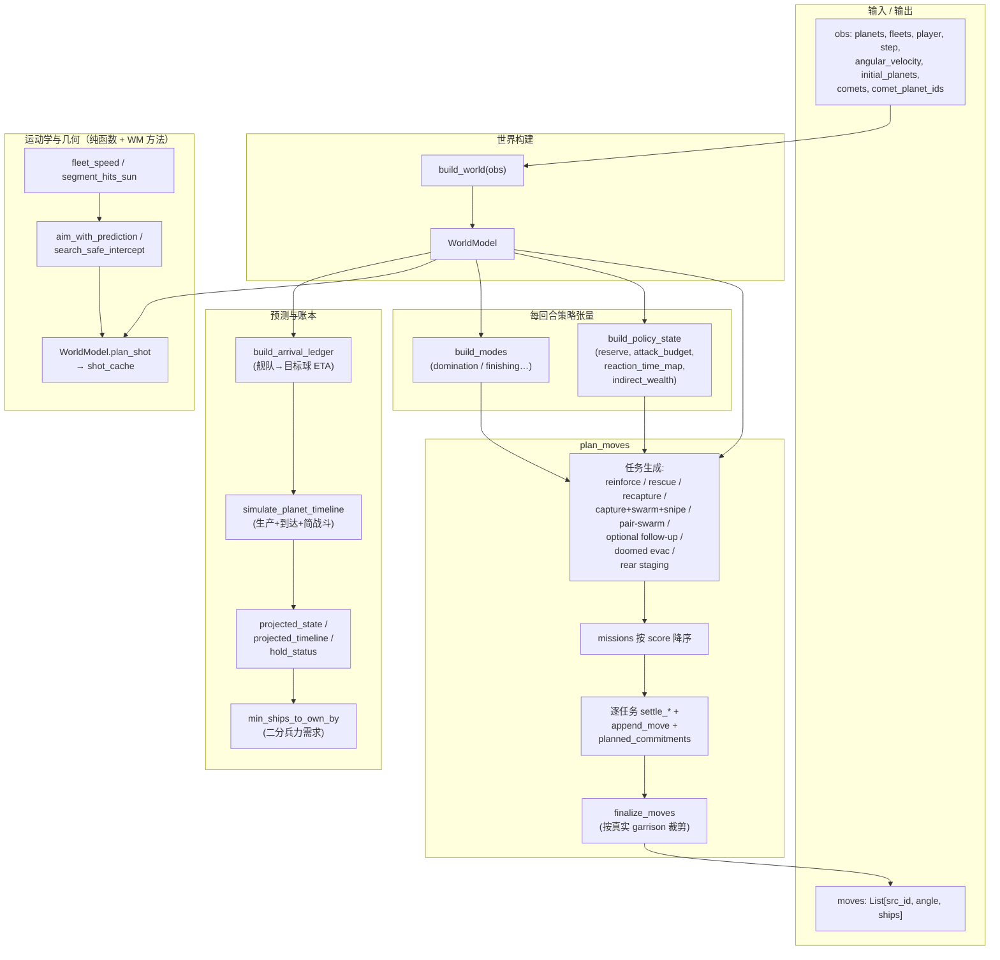
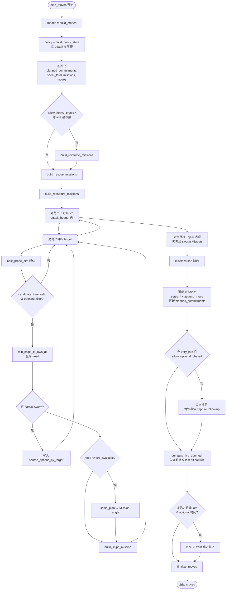

# 1103 Peaking Bot 技术分析

本文档对仓库内 `1103-peaking-bot.ipynb` 所生成/说明的 Orbit Wars 方案做**结构级**解读（基于 notebook 中大段 `%%writefile submission.py` 源码逻辑）。该方案作者在 Kaggle 笔记中自述曾冲到约 **1103** 名；实现为**单文件、启发式 + 贪心任务调度**，与 `orbit_submit` 系工程化拆包路线不同。

---

## 1. 设计目标与总览

| 项目 | 内容 |
|------|------|
| **入口** | `agent(obs, config)` → `build_world(obs)` → `plan_moves(world, deadline)` |
| **时间预算** | `deadline = perf_counter() + 0.8` 秒（与常见 `actTimeout≈1s` 留余量） |
| **哲学** | 每回合重算：不依赖深度搜索树，用**任务（Mission）**封装候选动作，按分数贪心提交；强调动目标拦截、太阳几何、舰队到达账本、分阶段算力 |

**与 README 规则对齐点：** 舰队对数速度 `fleet_speed`、连续段与太阳距离、轨道行星角速度预测、彗星 `paths` / `path_index` 等均在同一脚本内自实现。

---

## 2. 架构图（分层）

下图从**观测输入**到**动作输出**，按数据构建 → 策略状态 → 任务生成 → 贪心提交的层次组织。

**读图要点：**

- **Kine** 与 **Sim** 解耦：前者回答「给定船数能否打到、几回合到」；后者在固定/增量到达事件下推演球上归属与兵力，为 `need` 与防守服务。
- **`planned_commitments`**：本回合已决定发射的 `(eta, player, ships)` 会并入目标时间线，避免多任务重复透支同一目标。

---

## 3. 核心模块说明

### 3.1 `WorldModel`

构造阶段完成：

- 敌我中立列表、`num_players`、早/开局/末局标志、`remaining_steps`
- 各方 `owner_strength` / `owner_production`（含在途舰队兵力）
- **`arrivals_by_planet`**：用舰队航向与速度对各球做几何命中估计，得到 `(eta, owner, ships)` 列表
- **`base_timeline`**：每球在 horizon 内按回合推进生产与到达战斗（`resolve_arrival_event` 与游戏规则一致的「两强相减」简化）
- **派生映射**：`keep_needed_map`（保住本球最少留守）、`fall_turn_map`、`first_enemy_map`、`indirect_feature_map`（周围敌友中性产值加权）等
- **缓存**：`shot_cache`、`probe_candidate_cache`、`reaction_cache`、`exact_need_cache` 降低重复 `plan_shot` / 二分搜索成本

`WorldModel.plan_shot` 对 `(src_id, target_id, ships)` 调用 `aim_with_prediction`，返回含 **角度、回合数** 的瞄准结果（或 `None`）。

### 3.2 运动学与拦截

- **静态目标**：直线 + 太阳段检测；擦太阳则 `estimate_arrival` 返回 `None`。
- **动目标（轨道球 / 彗星）**：`aim_with_prediction` 在预测位置上做少量迭代；失败则 **`search_safe_intercept`**：在 `1…min(HORIZON, ROUTE_SEARCH_HORIZON)` 上枚举候选到达回合，对齐 `INTERCEPT_TOLERANCE` 做「自洽」拦截。

彗星单独用 `predict_comet_position` / `comet_remaining_life` 限制追击深度（如 `COMET_MAX_CHASE_TURNS`）。

### 3.3 `build_policy_state` 与 `build_modes`

**`build_policy_state`（带 `deadline` 早停）：**

- 对每个非己方球，取距其最近的若干己方/敌方源，算 **`reaction_time_map`**（双方最快合法反应 ETA）
- 对每个己方球：`reserve = max(精确 keep,  proactive_keep)`，其中 proactive 来自最近敌人 `plan_shot` 的 ETA 窗口与 **`stacked_enemy_proactive_keep`**（多敌同窗堆叠威胁）
- **`attack_budget`** = 当前驻军 − reserve，供进攻类任务使用

**`build_modes`：**

- 用总兵力差定义 `domination`，得到 behind / ahead / dominating / **finishing**（后期且产值占优）
- **`attack_margin_mult`**：领先略增进攻余量、落后略减、终结模式再增

### 3.4 任务估值与归一化

- **`target_value`**：以 `production * turns_profit` 为底，叠加静态/旋转/中立安全或争夺、`indirect_wealth`、彗星寿命折扣、暴露敌球（驻军低于「约 5 回合产值」）加成、终局歼灭倾向等。
- **性价比分数**：普遍采用 **`value / (send + turns * COST_WEIGHT + 1)`** 形式，再经 **`apply_score_modifiers`**（静态/四旋/密集中立等乘子；snipe/swarm 额外乘子）。

### 3.5 `settle_plan` / `settle_reinforce_plan`

对给定 `send` 试探：

1. `plan_shot` → `(angle, turns, …)`
2. 按任务类型取 **`eval_turn`**（例如 snipe 为 `max(turns, enemy_eta)`，rescue 为 `fall_turn`）
3. **`min_ships_to_own_by`**：在「已有账本 + 本回合 planned_commitments」下二分最小成功占领兵力
4. 与 **`preferred_send`** 给出的期望兵力对比，迭代 `send`（最多 `max_iter`），并从已探测候选中选可行解

`settle_reinforce_plan` 则调用 **`reinforcement_needed_to_hold_until`**，要求到达后在 `hold_until` 前持续为己方。

---

## 4. `plan_moves` 流程图（主路径）

下列为**一回合内**主逻辑顺序（省略部分早退与 `expired()` 细节；方框内为阶段名）。

**阶段语义简述：**

1. **Heavy**：星球不太多的情况下才跑 **reinforce**（省算力）。
2. **Rescue / Recapture**：针对 `fall_turn` 在窗口内的己方球——前者在失守前抵达增援，后者在失守后一窗口内夺回。
3. **主双重循环**：为每个 `(src, target)` 建 **single capture**、**partial 选项**（供 swarm）、**snipe**（对齐敌方到达回合）。
4. **Pair swarm**：同一目标上两源、ETA 在容忍内、且各自单独都不够但合起来够时，升成 `Mission(kind="swarm")`；执行时重新 `plan_shot` 对齐并校验 `projected_state` 在联合到达后为己方。
5. **Optional follow-up**：在仍有时间时，对剩余 `attack_budget` 做一轮「每源单最佳」补刀。
6. **Doomed evac**：若投影守不住且仍有库存，优先打出一发「弃子抢分」或撤向安全盟友。
7. **Rear staging**：后方安全球按比例向前沿 staging，缩短下回合距离。

---

## 5. 任务类型一览

| kind | 含义 | 主要构建位置 |
|------|------|----------------|
| `reinforce` | 跨球增援，延长己方球在威胁下的控制 | `build_reinforce_missions` |
| `rescue` | 失守前窗口内送达防守 | `build_rescue_missions` |
| `recapture` | 失守后窗口内夺回 | `build_recapture_missions` |
| `single` | 单源足额占领 | 主循环 `settle_plan` + capture |
| `snipe` | 对齐敌方命中后一回合的 eval_turn 偷中立 | `build_snipe_mission` |
| `swarm` | 双源协调（选项来自 `source_options_by_target`） | `plan_moves` 配对段 |
| `crash_exploit` / `tot_swarm` | 代码在 `settle_plan` 与执行分支中**预留** | 当前 notebook 版本中**未见**对应 `Mission(...)` 构建调用（见第 7 节） |

---

## 6. 常量表驱动的调参面

脚本顶部大量 `UPPER_SNAKE_CASE` 常量（开局旋转中立过滤、四玩家系数、防御 horizon、swarm 容忍、`SOFT_ACT_DEADLINE` 等）构成**显式策略面**：改数值即可移动「激进 ↔ 保守」谱系，而无需改控制流。这与「单文件比赛脚本」习惯一致。

---

## 7. 仓库副本中的工程注意点（审阅记录）

在对 notebook 导出源码做 `py_compile` 时，当前仓库内文本存在以下问题，**若你要把该方案当作可运行基线**，建议先修再测：

1. **`preferred_send`**：`if target.owner == -1:` 下一行 `margin = 2` 在原始文本中**未缩进到 if 块内**，会导致 `IndentationError`（见 notebook 对应 cell 字符串）。
2. **`missions.append(...)` 与 `missions.sort(...)`** 在部分行被写在**同一引号行**内且无分号；标准 Python 需换行或 `;` 分隔，否则为语法错误。请对照 Kaggle 上可运行版本或手工拆开。
3. **`agent` 内 `print`**：正式提交应移除，避免日志开销与评测噪音。
4. **死代码 / 未完成接线**：`detect_enemy_crashes` 已实现但**未被调用**；`THREE_SOURCE_SWARM_ENABLED` 等常量未参与构建三路 swarm（`swarm_eta_tolerance` 仅在 `len(options)>=3` 时使用，而当前仅生成双源 pair）。`crash_exploit` / `tot_swarm` 的执行分支存在，但与本仓库导出文本中的任务生成未闭合。

以上不影响将其作为**设计思路参考文档**阅读，但影响「原样复制即跑」。

---

## 8. 小结

- **强项**：世界模型 + 时间线 + 反应时间图 + `settle_plan` 迭代，形成可组合的**多任务贪心框架**；动目标与太阳处理完整；防守/撤退/后送有独立阶段。
- **弱项**：无区域图式全局路由、无对手意图模型 beyond ETA 几何；大量常量需 empirical 维护；部分扩展位未接线。

若需与 **`orbit_submit/`** 对比，可一并阅读 [`docs/ARCHITECTURE_submission_v20_zh.md`](../docs/ARCHITECTURE_submission_v20_zh.md) / [`docs/ARCHITECTURE_submission_v20.md`](../docs/ARCHITECTURE_submission_v20.md)；本文仅聚焦 1103 方案自身结构。
