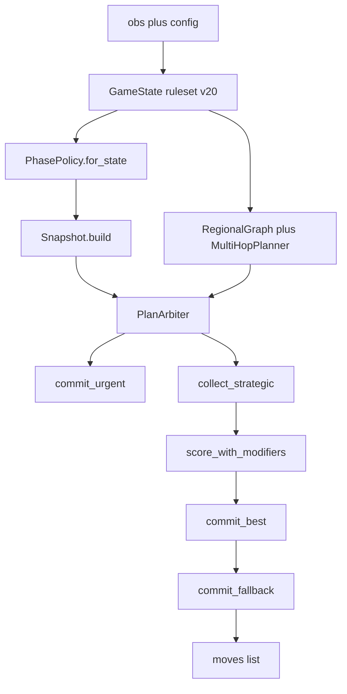

# Architecture: `submission_v20` (modular)

**中文版：** [ARCHITECTURE_submission_v20_zh.md](ARCHITECTURE_submission_v20_zh.md)

This document is the **canonical technical reference** for the v20 Orbit Wars bot after modularization. The **runtime source of truth** is the [`orbit_submit/`](../orbit_submit/) package; [`submission_v20.py`](../submission_v20.py) is a **thin Kaggle entry** that re-exports symbols for offline tools and tests.

## 1. Versioning and filenames

- **Canonical bot:** [`submission_v20.py`](../submission_v20.py) + [`orbit_submit/`](../orbit_submit/).
- **`submission_v20_0513.py`:** Deprecated shim that re-exports `agent` only. The filename is **not** a separate “0513 bot version”.
- **Codegen snapshot:** [`tools/templates/v20_monolith_for_v21_codegen.py`](../tools/templates/v20_monolith_for_v21_codegen.py) is a **frozen monolith** used by [`tools/gen_v21_submissions.py`](../tools/gen_v21_submissions.py) / [`tools/gen_v22_submissions.py`](../tools/gen_v22_submissions.py). Update it when the v20 *policy surface* (e.g. `NeuralVal` shapes) changes in a way those generators must patch.

## 2. Package map

| Module | Responsibility |
|--------|----------------|
| [`orbit_submit/constants.py`](../orbit_submit/constants.py) | Board/sun constants, fleet speed, geometry helpers, `ORB_STRATEGY_PROFILE`, scipy clustering hook for `RegionalGraph`. |
| [`orbit_submit/entities.py`](../orbit_submit/entities.py) | `Planet`, `Fleet`, `_combat`. |
| [`orbit_submit/game_state.py`](../orbit_submit/game_state.py) | `GameState` parsing, orbit/comet motion, `phase()`, duel/FFA helpers (`ruleset` `v20` vs `v21`). Imports `_get` explicitly (star-import does not re-export leading-underscore names). |
| [`orbit_submit/kinematics.py`](../orbit_submit/kinematics.py) | `safe_aim`, `capture_need`, `launch_hits_target_first`, `ENGINE_LAUNCH_PAD`, intercept helpers. |
| [`orbit_submit/regional.py`](../orbit_submit/regional.py) | `RegionalGraph`, `MultiHopPlanner`, `ProductionTimeline`, `calculate_safe_surplus`. |
| [`orbit_submit/snapshot.py`](../orbit_submit/snapshot.py) | `Snapshot` (per-turn liquidity, reserves, `is_safe_investment`, pending neutral waves). |
| [`orbit_submit/policy.py`](../orbit_submit/policy.py) | `PHASE_TABLE`, `_STRATEGY_PROFILE_DELTAS`, `PhasePolicy`, env overlays (`ORB_REGION_PRESSURE_RATIO`, etc.). |
| [`orbit_submit/scoring_early.py`](../orbit_submit/scoring_early.py) | `enemy_eta_power`. |
| [`orbit_submit/scoring_shared.py`](../orbit_submit/scoring_shared.py) | `approach_bonus`, `orbit_arc_strategic_score`, `recapture_bonus`, `contest_penalty`, `elite_eval`. |
| [`orbit_submit/targeting.py`](../orbit_submit/targeting.py) | **`target_score`**, **`regional_capture_adjustment`** (v20 heuristics). |
| [`orbit_submit/registry.py`](../orbit_submit/registry.py) | Hooks: `target_score`, `regional_capture_adjustment`, `neural_weights_b64`, `arbiter_variant`. |
| [`orbit_submit/neural_weights_v20.py`](../orbit_submit/neural_weights_v20.py) | `NEURAL_WEIGHTS_B64` checkpoint for `NeuralVal`. |
| [`orbit_submit/neural.py`](../orbit_submit/neural.py) | `NeuralVal` (14→64→32→1 by default), reads weights from `registry`. |
| [`orbit_submit/engine.py`](../orbit_submit/engine.py) | `capture_edge_score`, forward sim, planners, `MCTSEngine`, `PlanArbiter`, `agent` wiring is **not** here — see `agent.py`. |
| [`orbit_submit/agent.py`](../orbit_submit/agent.py) | Sets `registry` fields, constructs `PlanArbiter` pipeline, exports **`agent`**. |

## 3. Runtime flow (per step)

1. **`agent`** ([`orbit_submit/agent.py`](../orbit_submit/agent.py)): `GameState(obs, config, ruleset="v20")`.
2. **`PhasePolicy.for_state`**: picks `early` / `mid` / `late` row from `PHASE_TABLE` (with profile/env overlays).
3. **`Snapshot.build`**: per-planet `reserve` / `surplus` / `avail` used by planners and `_emit`.
4. **Regional layer:** best-effort `RegionalGraph` + `MultiHopPlanner` (failure → `None`, bot still runs).
5. **`PlanArbiter`:** urgent planners → strategic plans → sim + optional pessimistic rerank + MCTS/pragmatic bonuses + `NeuralVal` multiplier → gated `commit_best` → `commit_fallback`.

## 4. Scoring pipeline

- **`registry.target_score`** → implemented in [`orbit_submit/targeting.py`](../orbit_submit/targeting.py) (distance-dominant v20 heuristic).
- **`capture_edge_score`** ([`orbit_submit/engine.py`](../orbit_submit/engine.py)): `registry.target_score` + optional `registry.regional_capture_adjustment` when a `RegionalGraph` is present.
- **`target_value_in_region`:** thin wrapper around `capture_edge_score` (compat for docs/tests).

Import order for a **new** entry file: set `registry.*` **before** importing submodules that call `capture_edge_score` at import time (the stock [`orbit_submit/agent.py`](../orbit_submit/agent.py) already does this). [`submission_v20.py`](../submission_v20.py) imports `orbit_submit.agent` first.

## 5. `PHASE_TABLE` (where to tune)

All phase knobs live in [`orbit_submit/policy.py`](../orbit_submit/policy.py). Highlights:

| Knob group | Examples | Effect |
|------------|-----------|--------|
| Economy vs aggression | `reserve_growth_mul`, `cost_pen_mul`, `urgent_attack_ratio`, `mode_order` | How greedy expansion vs attacks are. |
| Search budget | `mcts_budget_ms`, `pragmatic_mcts_*`, `sim_steps`, `tempo_floor` | Wall-clock vs depth tradeoffs. |
| Commit gates | `region_pressure_ratio`, `safe_surplus_ship_mult`, `baseline_commit_margin` | `PlanArbiter.commit_best` trims or skips commits when regional pressure is high. Overridable per-process via env vars (see `_merged_phase_row`). |
| Pessimistic rerank | `paranoid_score_budget_ms`, `paranoid_blend`, … | `score_plan_actions_paranoid` blend into `score_with_modifiers`. |

Local-only **style profiles:** `ORB_STRATEGY_PROFILE` + `_STRATEGY_PROFILE_DELTAS` (same file). Do **not** use `@profile` tokens on Kaggle.

## 6. `PlanArbiter` variants

`registry.arbiter_variant` selects `commit_best` implementation (`v20` vs `v21`). v20 sets **`"v20"`** in [`orbit_submit/agent.py`](../orbit_submit/agent.py).

## 7. Packaging (Kaggle)

[`tools/package_orbit_submission.py`](../tools/package_orbit_submission.py) stages:

- `submission_<version>.py` → `main.py`
- `orbit_submit/` tree (minus `__pycache__`)

Default version `v20` therefore ships **thin `main.py` + full package**. Optional overrides: [`tools/orbit_submission_pack.yaml`](../tools/orbit_submission_pack.yaml).

**Dependency:** `RegionalGraph` prefers **scipy** (`fclusterdata`); without scipy the graph falls back to a simpler layout (see `RegionalGraph`).

## 8. Offline tools expectations

These import **`submission_v20`** as a module namespace:

- [`tools/paranoid_score.py`](../tools/paranoid_score.py) — `score_plan_actions*`, `GameState`.
- [`tools/test_launch_trajectory_gate.py`](../tools/test_launch_trajectory_gate.py) — `PlanArbiter`, kinematics, `_GLOBAL_*`.
- [`test_v19_regional.py`](../test_v19_regional.py) — regional types + geometry helpers.

[`submission_v20.py`](../submission_v20.py) re-exports the union of these symbols from `orbit_submit` so paths stay stable.

## 9. Change checklist

| Goal | Edit |
|------|------|
| Phase / budgets / gates | `orbit_submit/policy.py` |
| Target heuristic / regional tax | `orbit_submit/targeting.py` |
| Neural weights blob | `orbit_submit/neural_weights_v20.py` (and keep `registry.neural_weights_b64` in sync if you bypass `agent`) |
| Arbiter / sim / planners | `orbit_submit/engine.py` |
| Kaggle entry / re-exports | `submission_v20.py` |
| v21/v22 monolith codegen | `tools/templates/v20_monolith_for_v21_codegen.py` + `tools/gen_v21_submissions.py` |
