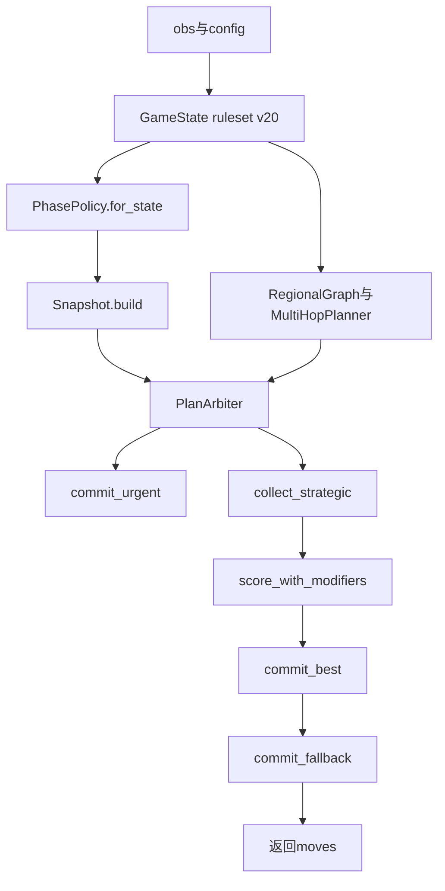

# 架构说明：`submission_v20`（模块化）

> **English:** [ARCHITECTURE_submission_v20.md](ARCHITECTURE_submission_v20.md)

本文是模块化之后 **v20 Orbit Wars 参赛 bot** 的**权威技术索引**。**运行时真源**在 [`orbit_submit/`](../orbit_submit/) 包内；[`submission_v20.py`](../submission_v20.py) 是 **Kaggle 薄入口**，并为离线工具与测试 **re-export** 一批符号。

## 1. 版本与文件名

- **默认真源：** [`submission_v20.py`](../submission_v20.py) + [`orbit_submit/`](../orbit_submit/)。
- **`submission_v20_0513.py`：** 已弃用的 shim，仅 re-export `agent`；**不是**所谓「0513 另一版 bot」。
- **代码生成用快照：** [`tools/templates/v20_monolith_for_v21_codegen.py`](../tools/templates/v20_monolith_for_v21_codegen.py) 是 **冻结的单文件 monolith**，供 [`tools/gen_v21_submissions.py`](../tools/gen_v21_submissions.py) / [`tools/gen_v22_submissions.py`](../tools/gen_v22_submissions.py) 打补丁（如 `NeuralVal` 宽度）。当 v20 **策略表面**（例如 `NeuralVal` 形状）发生生成器必须跟进的变更时，应同步更新该快照。

## 2. 包内模块一览

| 模块 | 职责 |
|------|------|
| [`orbit_submit/constants.py`](../orbit_submit/constants.py) | 棋盘/太阳常量、舰队速度、几何小工具、`ORB_STRATEGY_PROFILE`、供 `RegionalGraph` 使用的 scipy 聚类入口。 |
| [`orbit_submit/entities.py`](../orbit_submit/entities.py) | `Planet`、`Fleet`、`_combat`。 |
| [`orbit_submit/game_state.py`](../orbit_submit/game_state.py) | `GameState` 解析、轨道/彗星运动、`phase()`、决斗/FFA 辅助（`ruleset` 为 `v20` 与 `v21` 的分支）。显式导入 `_get`（`from constants import *` 不会带入以下划线开头的名字）。 |
| [`orbit_submit/kinematics.py`](../orbit_submit/kinematics.py) | `safe_aim`、`capture_need`、`launch_hits_target_first`、`ENGINE_LAUNCH_PAD`、拦截相关辅助。 |
| [`orbit_submit/regional.py`](../orbit_submit/regional.py) | `RegionalGraph`、`MultiHopPlanner`、`ProductionTimeline`、`calculate_safe_surplus`。 |
| [`orbit_submit/snapshot.py`](../orbit_submit/snapshot.py) | `Snapshot`（每回合流动性、`reserve`/`surplus`、`is_safe_investment`、中立波次在途等）。 |
| [`orbit_submit/policy.py`](../orbit_submit/policy.py) | `PHASE_TABLE`、`_STRATEGY_PROFILE_DELTAS`、`PhasePolicy`、环境变量覆盖层（如 `ORB_REGION_PRESSURE_RATIO`）。 |
| [`orbit_submit/scoring_early.py`](../orbit_submit/scoring_early.py) | `enemy_eta_power`。 |
| [`orbit_submit/scoring_shared.py`](../orbit_submit/scoring_shared.py) | `approach_bonus`、`orbit_arc_strategic_score`、`recapture_bonus`、`contest_penalty`、`elite_eval`。 |
| [`orbit_submit/targeting.py`](../orbit_submit/targeting.py) | **`target_score`**、**`regional_capture_adjustment`**（v20 主启发式）。 |
| [`orbit_submit/registry.py`](../orbit_submit/registry.py) | 钩子：`target_score`、`regional_capture_adjustment`、`neural_weights_b64`、`arbiter_variant`。 |
| [`orbit_submit/neural_weights_v20.py`](../orbit_submit/neural_weights_v20.py) | 供 `NeuralVal` 使用的 `NEURAL_WEIGHTS_B64` 检查点。 |
| [`orbit_submit/neural.py`](../orbit_submit/neural.py) | `NeuralVal`（默认 14→64→32→1），从 `registry` 读权重。 |
| [`orbit_submit/engine.py`](../orbit_submit/engine.py) | `capture_edge_score`、前向仿真、各类 planner、`MCTSEngine`、`PlanArbiter`；**`agent` 接线不在此文件**——见 `agent.py`。 |
| [`orbit_submit/agent.py`](../orbit_submit/agent.py) | 写入 `registry`、组装 `PlanArbiter` 流水线、导出 **`agent`**。 |

## 3. 单步运行时数据流

1. **`agent`**（[`orbit_submit/agent.py`](../orbit_submit/agent.py)）：`GameState(obs, config, ruleset="v20")`。
2. **`PhasePolicy.for_state`**：从 `PHASE_TABLE` 取 `early` / `mid` / `late` 一行（叠 profile / 环境变量）。
3. **`Snapshot.build`**：得到每星 `reserve` / `surplus` / `avail`，供 planner 与 `_emit` 使用。
4. **区域层：** 尽力构造 `RegionalGraph` + `MultiHopPlanner`；失败则置 `None`，bot 仍可跑。
5. **`PlanArbiter`：** 紧急 planner → 收集战略 plan → 仿真 + 可选悲观重排 + MCTS/务实 UCB 加成 + `NeuralVal` 乘性修正 → 门控 `commit_best` → `commit_fallback`。

## 4. 打分链路

- **`registry.target_score`** → 实现在 [`orbit_submit/targeting.py`](../orbit_submit/targeting.py)（v20 距离主导启发式）。
- **`capture_edge_score`**（[`orbit_submit/engine.py`](../orbit_submit/engine.py)）：`registry.target_score` + 若有 `RegionalGraph` 则可选 **`registry.regional_capture_adjustment`**。
- **`target_value_in_region`：** 对 `capture_edge_score` 的薄封装（文档/测试兼容）。

若写**新的**入口文件：须在 **import** 会在 import 期就调用 `capture_edge_score` 的子模块 **之前** 填好 `registry.*`（现成 [`orbit_submit/agent.py`](../orbit_submit/agent.py) 已按此顺序）。[`submission_v20.py`](../submission_v20.py) 会先 `import orbit_submit.agent`。

## 5. `PHASE_TABLE`（调参入口）

所有相位旋钮集中在 [`orbit_submit/policy.py`](../orbit_submit/policy.py)。常见分组：

| 旋钮组 | 示例字段 | 作用 |
|--------|-----------|------|
| 经济 vs 侵略 | `reserve_growth_mul`、`cost_pen_mul`、`urgent_attack_ratio`、`mode_order` | 扩张与进攻的贪婪程度、模式顺序。 |
| 搜索预算 | `mcts_budget_ms`、`pragmatic_mcts_*`、`sim_steps`、`tempo_floor` | 墙钟时间与搜索深度的折中。 |
| 提交门控 | `region_pressure_ratio`、`safe_surplus_ship_mult`、`baseline_commit_margin` | 区域压力大时 `PlanArbiter.commit_best` 裁剪或放弃提交；可用进程级环境变量覆盖（见 `_merged_phase_row`）。 |
| 悲观重排 | `paranoid_score_budget_ms`、`paranoid_blend`、… | `score_plan_actions_paranoid` 结果混入 `score_with_modifiers`。 |

**仅本地**的风格 profile：`ORB_STRATEGY_PROFILE` + `_STRATEGY_PROFILE_DELTAS`（同文件）。**Kaggle 正式提交不要**使用 `v20@xxx` 这类 `@profile` 后缀。

## 6. `PlanArbiter` 分支

`registry.arbiter_variant` 选择 `commit_best` 的实现（`v20` 与 `v21`）。v20 在 [`orbit_submit/agent.py`](../orbit_submit/agent.py) 里设为 **`"v20"`**。

## 7. Kaggle 打包

[`tools/package_orbit_submission.py`](../tools/package_orbit_submission.py) 会暂存：

- `submission_<version>.py` → `main.py`
- 整棵 `orbit_submit/` 目录（排除 `__pycache__`）

默认 **`--version v20`** 即 **薄 `main.py` + 完整包**。可选清单：[`tools/orbit_submission_pack.yaml`](../tools/orbit_submission_pack.yaml)。

**依赖：** `RegionalGraph` 优先使用 **scipy**（`fclusterdata`）；无 scipy 时走简化布局（见 `RegionalGraph`）。

## 8. 离线工具约定

以下脚本仍以 **`submission_v20`** 为模块命名空间 import：

- [`tools/paranoid_score.py`](../tools/paranoid_score.py) — `score_plan_actions*`、`GameState`。
- [`tools/test_launch_trajectory_gate.py`](../tools/test_launch_trajectory_gate.py) — `PlanArbiter`、运动学、`_GLOBAL_*`。
- [`test_v19_regional.py`](../test_v19_regional.py) — 区域图类型与几何辅助函数。

[`submission_v20.py`](../submission_v20.py) 从 `orbit_submit` **re-export** 上述并集，路径保持稳定。

## 9. 改动速查表

| 目的 | 编辑文件 |
|------|----------|
| 相位 / 预算 / 门控 | `orbit_submit/policy.py` |
| 目标启发式 / 区域税 | `orbit_submit/targeting.py` |
| 神经网络权重串 | `orbit_submit/neural_weights_v20.py`（若绕过 `agent` 自行设 `registry`，须与之一致） |
| Arbiter / 仿真 / planner | `orbit_submit/engine.py` |
| Kaggle 入口 / re-export | `submission_v20.py` |
| v21/v22 monolith 代码生成 | `tools/templates/v20_monolith_for_v21_codegen.py` + `tools/gen_v21_submissions.py` |
