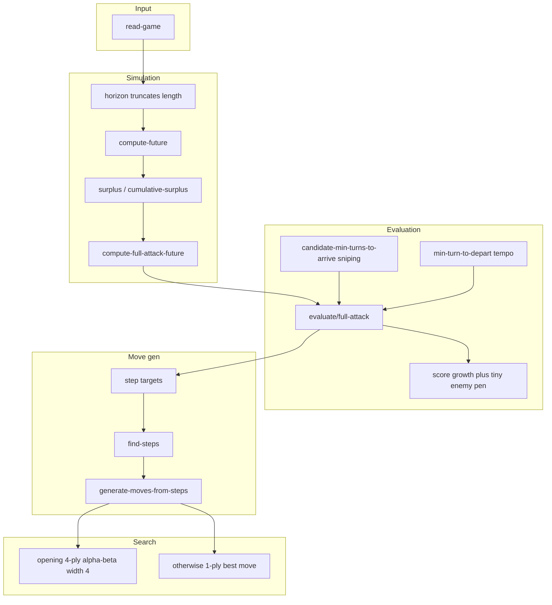

# Planet Wars（2010）冠军源码 — 架构说明与 Orbit Wars 对照

本目录为 Gábor Melis（Bocsimackó）的 **Common Lisp 冠军实现**（[GitHub: melisgl/planet-wars](https://github.com/melisgl/planet-wars) 镜像）。网页镜像与历史外链见 [references/planet-wars/README.md](../references/planet-wars/README.md)。赛后复盘全文见仓库根目录 [2010Planet-war-readme.txt](../2010Planet-war-readme.txt)（[线上版](http://quotenil.com/Planet-Wars-Post-Mortem.html)）。

---

## 0. 本仓库文档导航（新增）

### 分层 README

每个子文件夹下的 **`README.md`** 说明目录内文件的用途：

| 目录 | 链接 |
|------|------|
| 运行时脚本 | [bin/README.md](bin/README.md) |
| 地图数据 | [maps/README.md](maps/README.md) |
| Java JAR（引擎 / 回放） | [tools/README.md](tools/README.md) |
| Java 示例 Bot | [example_bots/README.md](example_bots/README.md) |
| 保存的对局 | [games/README.md](games/README.md) · [games/2010-11-30-…/README.md](games/2010-11-30-13-21-57-iouri-vs-bocsimacko/README.md) |
| 全部 Lisp 源码与依赖树 | [src/README.md](src/README.md) · [中文注释副本（docs）](docs/translated-sources/README.md) |
| `planet-wars-util` | [src/util/README.md](src/util/README.md) |
| TCP 代理 | [src/proxy-bot/README.md](src/proxy-bot/README.md) |
| Alexandria | [src/alexandria/README.md](src/alexandria/README.md) · [src/alexandria/doc/README.md](src/alexandria/doc/README.md) |
| parse-number / split-sequence | [src/parse-number/README.md](src/parse-number/README.md) · [src/split-sequence/README.md](src/split-sequence/README.md) |
| usocket（含 backend/doc/notes/test） | [src/usocket-0.4.1/README.md](src/usocket-0.4.1/README.md) |

### Lisp 符号与函数一览（自动生成）

- **[docs/symbols/INDEX.md](docs/symbols/INDEX.md)**：每个 `.lisp` → 一页符号表。
- **[docs/symbols/README.md](docs/symbols/README.md)**：生成器用法。
- **手写冠军模块综述**（中文）：[docs/symbols/handwritten/CHAMPION_MODULES_zh.md](docs/symbols/handwritten/CHAMPION_MODULES_zh.md)
- **手写逐符号中文**（冠军链路 `timer`/`package`/`model`/`io`/`play`/`alpha-beta`/`player`/`MyBot*` 等）：[docs/symbols/handwritten/detail/](docs/symbols/handwritten/detail/)
- **中文注释源码副本**（仅增注释、与原版同构，供对照阅读）：[docs/translated-sources/](docs/translated-sources/)

重新生成：`python3 planet-wars/scripts/gen_lisp_symbol_docs.py`（不写 `handwritten/detail/`）。

### 根目录零散文件（无 `.lisp` 扩展）

| 文件 | 含义 |
|------|------|
| [README](README) | 上游原始说明文本（Contest 时代的 `README`） |
| [README-LISP](README-LISP) | Lisp/SBCL/Allegro 相关安装与运行备忘 |
| [planet-wars.asd](planet-wars.asd) | ASDF 系统：`src` **串行**载入顺序、`depends-on` 外部库 |
| [Makefile](Makefile) / [configure](configure) | 构建、`submission` zip |
| [MyBot.lisp](MyBot.lisp) / [RunMyBot.lisp](RunMyBot.lisp) / [ProxyBot.lisp](ProxyBot.lisp) | Kaggle/submission / 本地脚本 / TCP 对战入口包装 |
| [setup.lisp](setup.lisp) | 在无 Quicklisp 环境下注册 ASDF / 源码路径 |

**目录快照**：[docs/DIRECTORY_INDEX.md](docs/DIRECTORY_INDEX.md)

---

## 1. 源文件分工

| 文件 | 内容 |
|------|------|
| [src/model.lisp](src/model.lisp) | `planet` / `order` / `game`：离散邻接、按回合的 `arrivals-*` / `departures-*`、航程。 |
| [src/player.lisp](src/player.lisp) | **核心**：`future` 推演、`surplus` / `full-attack-future`、局面分、`step`/`move` 生成、`safe-to-invest-p`、动态 `horizon`、`compute-orders`。 |
| [src/alpha-beta.lisp](src/alpha-beta.lisp) | 浅层 α-β、`widths` 控制分支宽度、与 `evaluate/full-attack` 的衔接。 |

---

## 2. 决策管线（概念）

**要点**：每一颗星在 horizon 内有一串「归属 + 兵力」；由 **surplus** 推出可外派船量；再假设全员用 surplus **持续增援某星** 得到 full-attack 局面并积分；走子 = 按到达向量生成 step → 排序组合成 move；开局用 **4 层 α-β × 每层 4 分支**，占领数颗本家星后退回 **1-ply**。

---

## 3. 与 Orbit Wars 的差异（为何不能直搬）

| Planet Wars | Orbit Wars |
|-------------|------------|
| 图上整数航程、离散回合桶 | 连续几何、`fleet_speed` 对数曲线、`lead_intercept` |
| 无太阳 | 太阳半径与 `safe_aim` 射线避日 |
| 可把订单排到未来 turn | 每回合仅当周发射列表 |
| 固定邻接 `neighbours` | 需几何邻域 / 区域图等（如 v19 区域模块是独立实验层） |

在 **`submission_v13.py`**（现位于 `../archive/legacy/submissions/`）一类基线里，与 PW **概念对应**的常见落点包括：`Snapshot.surplus`/`reserve`、`target_score` 的 snipe 与 horizon 截断、`PhasePolicy.tempo_floor` + `score_plan_actions`、宽松版 `is_safe_investment`。全量 **cumulative-surplus 时间向量** 与 Lisp 级 `safety-margin` 未按原样移植（成本与数据结构差异大），见 [AGENTS.md](../archive/legacy/docs/AGENTS.md) 中 v11 小节。

---

## 4. 若将 PW 思想实验进 Orbit Wars 提交

- **应用前请用 `scripts/eval_head2head.py` 对固定 seed 回归**；PW 启发式在 **v19 等区域实验分支**上若未经验证不要随意合并。
- 更稳妥的试验入口是以 **`archive/legacy/submissions/submission_v13.py`（或你当前认定的主提交）** 为母本复制新版文件改参。

---

## 5. 关键 Lisp 符号速查（`player.lisp`）

| 符号 | 含义 |
|------|------|
| `compute-future*` / `compute-future` | 在给定到达/出发向量下前推战斗与生产。 |
| `cumulative-surplus` / `surplus` | 自 horizon 往回扫的可外派兵力时间结构。 |
| `compute-full-attack-future` | 所有星 surplus 持续砸向一星的增援场景。 |
| `score` | 产能差 + 占中损耗 + 极小敌方兵力位置罚。 |
| `candidate-min-turns-to-arrive` | 中立 sniping 多档到达约束。 |
| `safe-to-invest-p` / `safety-margin` | 投资中立前的余量与「安全」地平线。 |
| `horizon` | 用安全中立的 breakeven 相关量**缩短**前瞻（不全拉长）。 |
| `compute-orders`（`bocsimacko`） | 开局 α-β / 其余 1-ply + 超时兜底。

**完整逐项列表**：[docs/symbols/by-file/src__player.md](docs/symbols/by-file/src__player.md)

---

## 6. 无需强求移植的部分

作者复盘已说明 **Nash 混合策略** 实验价值有限；**未来多回合订单** 与 OW 引擎接口不一致；纯 **图邻接** 需替换为连续几何或分层抽象。
