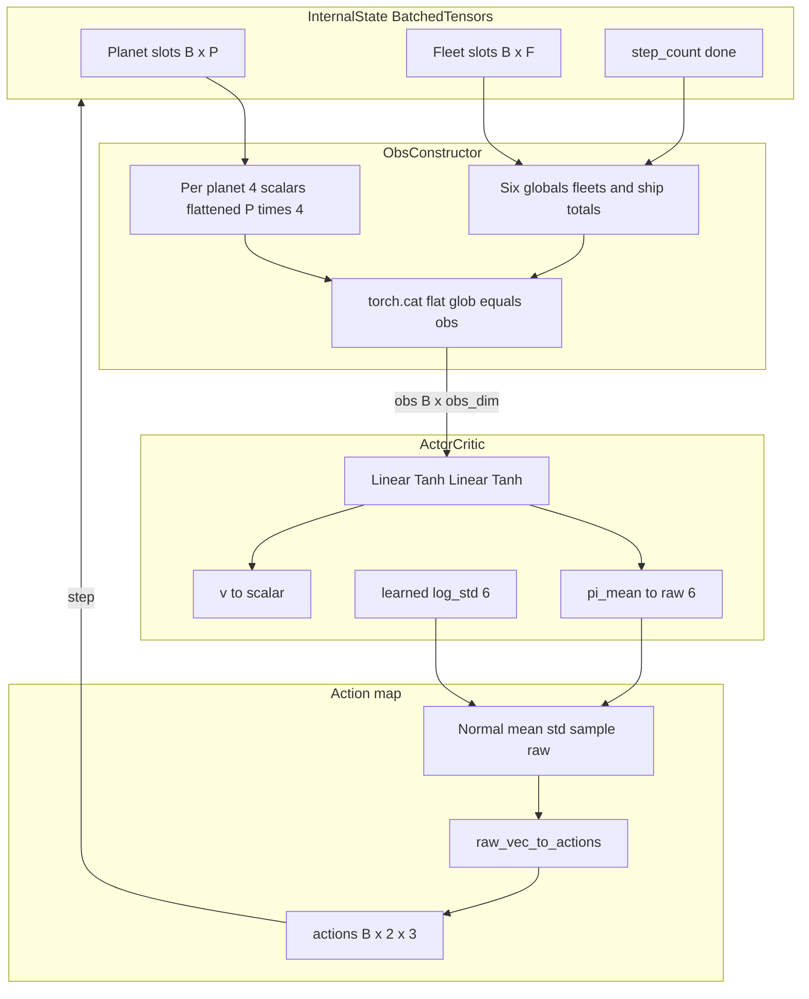
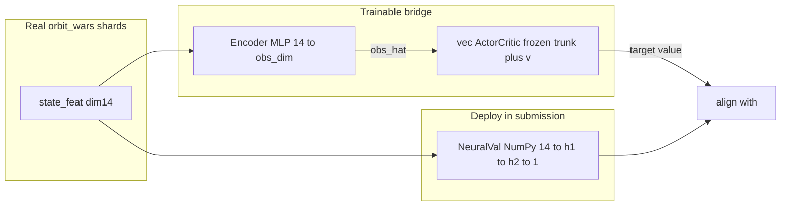

# vec_orbit：向量化结构、I/O 与落地到 submission 的全流程

本文说明 **仿真侧张量怎么拼**、**策略头输入输出**、以及 **如何得到可提交的 `submission_v21_*.py`**（与 Kaggle 真环境的关系）。

---

## 1. 双轨制（必须先分清）

| 轨道 | 状态 / 特征 | 策略网络 | 产物 |
|------|----------------|----------|------|
| **vec_orbit** | `BatchedOrbitEnv` 的 `obs_dim = P×4+6` | [`ActorCritic`](policy.py) → 6 维高斯 | `runs/vec_orbit/*.pth`（**不是**提交物） |
| **可提交 v21** | 真局里 `state_feat` **14 维** + plan **17 维**（见 [`tools/v21/feature_extractor_v20.py`](../tools/v21/feature_extractor_v20.py)） | [`tools/v21/nets.py`](../tools/v21/nets.py) `PolicyValueNet` | `policy_latest.pth` → 蒸馏进 `NeuralVal` |

**vec_orbit 与 submission 的观测维度不一致**，不能把一个 `.pth` 直接拷进提交文件。落地到提交物仍要走 **真环境 rollout + v21 learner + distill**；vec_orbit 用于 **高产仿真、算法摸底、未来可做课程学习/辅助损失**（需另接对齐模块）。

---

## 2. 向量化状态：内部张量 vs 观测向量（拼接方式）

环境内部**不**把「图」或「embedding」先算好再经 Transformer，而是 **固定槽位张量 + 手工归一化 + `cat`**。

### 2.1 行星槽（形状 `(B, P)`）

对每槽位 `p ∈ [0,P)`：

| 张量 | 含义 |
|------|------|
| `px, py` | 坐标（Episode 内固定） |
| `ships` | 驻军 |
| `owner` | `-1` 空槽 / `0` 中立 / `1` 玩家0 / `2` 玩家1 |
| `growth` | 每步产量 |
| `valid` | 是否本局使用该槽 |

### 2.2 舰队槽（形状 `(B, F)`）

| 张量 | 含义 |
|------|------|
| `fx,fy` | 位置 |
| `fvx,fvy` | 速度 |
| `fships` | 舰载规模 |
| `fowner` | 归属 |
| `fdest` | 目标行星下标 |
| `f_active` | 是否在飞 |

### 2.3 拼成策略输入 `obs`（形状 `(B, obs_dim)`）

实现见 [`batched_env.py`](batched_env.py) 中 `_obs()`：

1. **行星块**：对每个 `p`，4 个数 **`cat`** 成一列再 `reshape` 成 `(B, P*4)`  
   - `px/BOARD`, `py/BOARD`  
   - `ships/500`（clamp）  
   - 所有权编码：`valid` 时为 `owner/2`，否则 `-0.5`（占位）

2. **全局块**：`(B, 6)`，与上面再 **`torch.cat(..., dim=1)`**  
   - `step_count / max_steps`  
   - 玩家在飞舰队占比（对 `F` 归一）  
   - 中立 / 双方星球上兵力总和（归一）

**没有**可学习 token embedding；若要与 v21 对齐，需单独设计 **从 GameState → 14 维** 的映射或蒸馏目标，不在 v1 内。

---

## 3. 动作：网络输出 → `env.step`

- 策略头输出 **`raw` (B, 6)**，视为 **6 个独立高斯** 的 `rsample`（[`policy.py`](policy.py) `act()`）。  
- [`action_utils.raw_vec_to_actions`](action_utils.py) 把 `raw` 变成 **`actions` (B, 2, 3)**：每名玩家 `[src, dst, frac]`。  
  - `src,dst`：`(tanh+1)/2 * (P-1)` 浮点，`step` 里再 `long` clamp。  
  - `frac`：`sigmoid` 后夹在 `[0.02, 1]`。

---

## 4. 架构图（数据流）



训练回路见 [`train_loop.py`](train_loop.py)：`reset → rollout horizon → MC return → policy / value loss`。

---

## 5. 可提交 submission 的推荐全流程（真环境）

与 vec_orbit **独立**，沿用仓库既有工具链：

```text
1) 生成 submission 壳（从 v20 改 NeuralVal 宽度，清空权重）
      python tools/gen_v21_submissions.py

2) 真环境 RL（多进程 rollout + learner）
      ./scripts/train_v21_lite.sh
   得到 runs/v21_lite/policy_latest.pth 与 shard_w*.msgpack

3) 蒸馏：教师 = PolicyValueNet checkpoint，学生 = submission 内 NumPy MLP（14→h1→h2→1）
      python tools/distill_to_numpy_v21.py \
        --checkpoint runs/v21_lite/policy_latest.pth \
        --teacher-tier lite \
        --target-submission submission_v21_lite.py \
        --shards-dir runs/v21_lite \
        --out-b64 neural_weights.b64.txt

4) 把 neural_weights.b64.txt 全文粘到 submission_v21_lite.py 的 _NEURAL_WEIGHTS_B64
   （或自己写脚本替换该字符串）

5) 校验
      python3.13 -m py_compile submission_v21_lite.py
      python3.13 scripts/eval_head2head.py --a v21_lite --b v20 --seeds 0-4
```

### 5.1 为什么「可提交步骤」里没有跑 vec_orbit 里的脚本？

上面 1)–5) 的目标是：**产出一颗能写进 `submission_v21_*.py` 里 `NeuralVal` 的权重**。那颗权重必须由 **真 `orbit_wars` + v21 `PolicyValueNet` + shard 里的 14/31 维特征** 定义；[`train_loop.py`](train_loop.py) 训练的是 **另一套观测、另一套策略头**，`.pth` **不能**直接替换 `distill_to_numpy_v21.py` 的 `--checkpoint`（教师格式不同）。

所以：**可提交流程里故意不写 `python -m vec_orbit.train_loop`**，不是漏写，而是 **当前仓库没有把 vec_orbit 权重桥接到 submission**。

若要做 **GPU 上高产试验**（与提交物脱钩），在同一台机器上可并行跑，例如：

```bash
# 或仓库根目录一键脚本（tee 到 logs/，权重 runs/vec_orbit/policy_<stamp>.pth）
./scripts/train_vec_orbit.sh

python -m vec_orbit.train_loop --device cuda --batch 4096 --horizon 64 --updates 500 \
  --out runs/vec_orbit/policy_actor_critic.pth
python -m vec_orbit.bench --device cuda --batch 8192 --steps 200
```

### 5.2 「直接训练」是不是又变成 CPU 密集？

分两条线说：

| 流程 | 主要算力花在哪 |
|------|----------------|
| **v21 真环境训练**（`train_v21_*.sh`） | **Rollout**：`kaggle_environments` + 整份 submission 逻辑在 **多进程 CPU**；**Learner**：`learner_v21.py` 里 `games_to_tensors` + 更新 **一般在 GPU**（若 `torch.cuda.is_available()`）。所以整体常表现为 **CPU 打满、GPU 闲**——这是接口与 bot 形态决定的，不是「忘了用 GPU」。 |
| **vec_orbit**（`train_loop.py --device cuda`） | `BatchedOrbitEnv` 的状态与 `step()` 在 **GPU**；`ActorCritic` 的 forward / backward 在 **GPU**。**例外**：每次 `reset()` 里 [`layouts.sample_planets_cpu`](layouts.py) 在 **CPU + NumPy** 上为每个 seed 摆星球，复杂度约 `O(B)`；**每个 optimizer update 只调一次 reset**，若 `horizon` 较大，摊下来通常比「整段 rollout 在 CPU」轻得多。舰队循环仍是 **Python `for f in range(F)`**（F 固定、e.g. 32），相对 `B×F` 张量仍有一点 CPU 调度开销，但主体已是 GPU。 |

**结论**：要 **可提交**，现阶段仍须以 **§5 真环境步骤** 为主（CPU 重在做对局）；要 **减少「训练循环里模拟」的 CPU 占比**，才用 **vec_orbit + CUDA** 做旁路实验——它和提交链是 **两条线**，文档里分开写是有意的。

蒸馏逻辑摘要：教师吃 **31 维**（14 维 `state_feat` + 17 维 plan 占位从 shard 来），见 [`distill_to_numpy_v21.py`](../tools/distill_to_numpy_v21.py)；学生只学 **14 维状态价值** 以对齐 `submission_v20` 里的 `NeuralVal`。

---

## 6. v22：vec_orbit **接到**可提交 `submission_v22_*`（桥接蒸馏）

v22 在 **不改动 Kaggle 局内 agent 结构**（仍是 v20 管线 + `NeuralVal`）的前提下，用 **可训练编码器**把真局里的 **`state_feat`（14 维）** 映到 **vec_orbit 的 `obs` 空间**，再用 **已训练好的 vec_orbit `ActorCritic` 的价值头**当 **教师**，把 **数值靶**压进 **14→h1→h2→1** 的学生（与 `distill_to_numpy_v21` 同款 `StudentMLP`），最后 **`encode_b64` → `_NEURAL_WEIGHTS_B64`**。



**依赖**：盘上要有 **真环境** rollout 的 **`shard_w*.msgpack`**（内含 `transitions[].state_feat`）。可用 **只跑 v20 随机/老 bot 的短 rollout** 凑样本，**不必**等 v21 RL 收敛。

**一键（仓库根目录）**：

```bash
export SHARDS_DIR=runs/v21_lite   # 或任何含 shard_w*.msgpack 的目录
chmod +x scripts/train_v22_submit.sh
./scripts/train_v22_submit.sh     # 可选 TIER=lite|pro|ultra OUT_VEC=... OUT_B64=...
```

手动拆步：

```bash
python tools/gen_v22_submissions.py              # 生成 submission_v22_lite.py 等
./scripts/train_vec_orbit.sh                     # 得 runs/vec_orbit/policy_*.pth
python tools/distill_vec_bridge_v22.py \
  --vec-checkpoint runs/vec_orbit/policy_....pth \
  --shards-dir "$SHARDS_DIR" \
  --target-submission submission_v22_lite.py \
  --out-b64 neural_weights_v22_lite.b64.txt
# 将 out-b64 全文粘进 submission_v22_lite.py 的 _NEURAL_WEIGHTS_B64
```

**注意**：教师价值是在 **简化仿真** 上学的；编码器学的是 **使 `V_vec(E(s))` 可监督**，**提交时只带 NeuralVal**，不带 `E` 与 vec 权重。分布仍与纯 v21 教师不同，需 **真环境 eval** 自测。

---

## 7. vec_orbit 在整体里的位置（务实预期）

- **v21**：真环境 `PolicyValueNet` → `distill_to_numpy_v21.py` → v21 submission。  
- **v22**：vec_orbit 价值 + `distill_vec_bridge_v22.py` → v22 submission；**同样需要真 shard 提供 14 维轨迹**。  
- vec_orbit **单独**训练仍可作为与提交脱钩的吞吐实验（§5.2）。
